> 大家好！我是瓜哥，前互联网技术总监，现专注于 AI 编程领域的探索和分享。

最近 **Skills** 的讨论热度很高。我前几天写了一篇 [如何用 Agent Skill 封装自动化写作工作流](https://mp.weixin.qq.com/s?__biz=Mzk5MDcyODQ2Mw==&mid=2247488865&idx=1&sn=2f4ebd76bf7eac91ce7f46e6519650c0&scene=21#wechat_redirect) 的文章，很多朋友看完问：还有没有现成的 Skill，拿来就能用？

我懂，你们不想自己从零开始写。

于是我花了点时间，把 Anthropic 官方仓库里的 Skill 全部扒了一遍。整理成这份 '宝藏清单'，涵盖从文档自动化到代码生成，让你效率直接翻倍！

今天一次性分享给大家。

共 **5 大分类，14 个 Skill。** 文档处理、代码生成、创意设计、沟通辅助，全都有。拿来就能用。

---

先看两个官方 Skill 的实际效果。

##### Demo 1：高质量前端界面

Claude Code 调用 `frontend-design` Skill，生成完整的 React 代码。不再是千篇一律的紫色渐变，细节设计和排版都很精细（点图片，放大看）。

##### Demo 2：算法艺术

调用 `algorithmic-art` Skill，生成参数化的艺术作品。同一套算法，能生成无限变体。

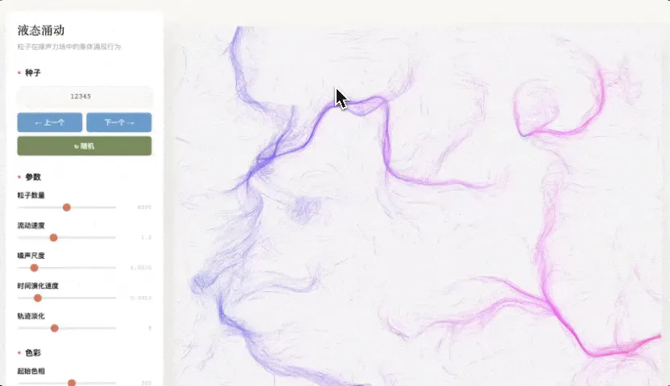

  

接下来。不仅介绍这 14 个 Skill，还有如何安装、如何使用、实战演示等。干货满满，强烈建议先收藏，再阅读。

---

# 一、官方 Skills 速览

所有 Skills 均来自 **Anthropic 官方仓库**。文档类 Skills（docx/xlsx/pptx/pdf）为闭源，其他为 Apache 2.0 开源。

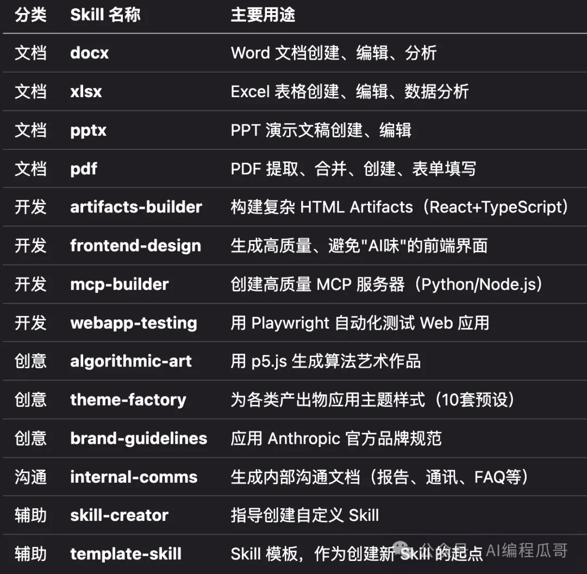

# 二、5 大类官方Skills详解

## 01 | 文档类 Skills

Claude 压箱底的文档实现能力，覆盖办公四大件（Word/PDF/PPT/Excel）。说白了，就是 Claude.ai 里那些能直接生成 Word、Excel、PPT 的功能，背后都是它们在干活。

##### **1\. docx** - Word 文档处理

Word 文档的创建、编辑、分析。支持批注、修订追踪、格式保留。你让 Claude 帮你写个报告，它就会自动调用这个 Skill，直接给你一个 .docx 文件。

##### **2\. xlsx** - Excel 表格处理

Excel 表格操作。支持公式、格式、数据分析、可视化。处理 .xlsx、.csv、.tsv 都行。让 Claude 帮你做个销售数据分析，它能直接给你带公式的表格。

##### **3\. pptx** - PowerPoint 演示文稿处理

PPT 的创建和编辑。支持模板、图表、自动生成幻灯片。你给它一份大纲，它能直接给你一套完整的演示文稿。

##### **4\. pdf** - PDF 文档处理

PDF 操作全家桶。提取文本、提取表格、合并拆分、表单填写，都能搞定。特别是表单填写这个功能，之前 Claude 是做不到的，有了这个 Skill 就行了。

## 02 | 开发类 Skills

这是开发者工具箱，全部开源（Apache 2.0），不仅能用，还能直接看源码学习。

##### **1\. artifacts-builder（**复杂 Artifacts 构建）

用来构建复杂的 Claude.ai Artifacts。技术栈是 React 18 + TypeScript + Tailwind CSS + shadcn/ui。如果你需要做一个有状态管理、有路由的复杂交互组件，用这个。它还特别强调要避免"AI 味"设计，有完整的初始化和打包脚本。

##### **2\. frontend-design（**高质量前端界面设计）

生成高质量的前端界面。这个 Skill 的核心理念就是避免"AI slop"——那种一眼看上去就是 AI 生成的东西：过度居中、紫色渐变、统一圆角、Inter 字体。它会引导 Claude 做出更有设计感的界面。

##### **3\. mcp-builder**（MCP 服务器创建指南）

指导创建 MCP 服务器。支持 Python（FastMCP）和 Node/TypeScript（MCP SDK）两种方案。如果你想让 Claude 连接外部 API 或服务，这个 Skill 能帮你快速搭建。

##### **4\. webapp-testing（**Web 应用自动化测试）

用 Playwright 测试本地 Web 应用。能验证前端功能、调试 UI、截图、查看浏览器日志。自动化测试的好帮手。

## 03 | 创意类 Skills

这是用来提升Claude Code 艺术设计能力的，同样开源。

##### **1\. algorithmic-art（**算法艺术生成）

用 p5.js 创建算法艺术。这个 Skill 很有意思，它不是让你直接画画，而是先让你创建一个"算法哲学"（用 .md 文件描述你想要的美学风格），然后再生成代码。支持种子随机，同一套算法可以生成无限变体。还有交互式查看器，可以实时调参数。

##### **2\. theme-factory（**主题样式应用工厂）

主题工厂。内置 10 套预设主题（颜色 + 字体），可以应用到幻灯片、文档、报告、网页等各种产出物上。需要统一视觉风格的时候很好用。

##### **3\. brand-guidelines（**品牌规范应用）

应用 Anthropic 官方品牌规范。包含品牌色彩（Dark [#141413](javascript:;)、Light [#faf9f5](javascript:;)、Orange [#d97757](javascript:;) 等）和字体规范。如果你想做 Anthropic 风格的设计可以直接用，也可以参考它的结构，做一套自己公司的品牌 Skill。

## 04 | 沟通类 Skills

##### **1\. internal-comms（**内部沟通文档生成）

内部沟通模板。支持状态报告、领导更新、3P 更新、公司通讯、FAQ、事故报告、项目更新等各种格式。需要写内部邮件或文档的时候，Claude 会自动套用你公司习惯的格式。

## 05 | 辅助类 Skills

##### **1\. skill-creator（**Skill 创建指南）

指导你创建自己的 Skill。直接跟 Claude 说"帮我创建一个 xxx 的 Skill"，它会一步步引导你完成。

##### **2\. template-skill（**Skill 模板）

Skill 模板。包含基础的 SKILL.md 结构和 YAML frontmatter 示例。想自己写 Skill 的话，可以从这个模板开始。

# 三、怎么安装 Skills？

很简单，直接在 Claude Code 里安装就行。

## 01 | 从 Marketplace 插件市场安装

**第 1 步**，将官方仓库添加为插件市场

`/plugin marketplace add https://github.com/anthropics/skills` 

看到这条消息，anthropic-agent-skills 就添加成功了。

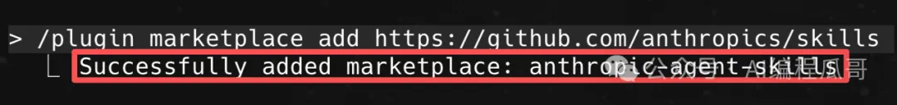

**第 2 步**，输入 `/plugin install`，Tab 键切换到 **Marketplace**

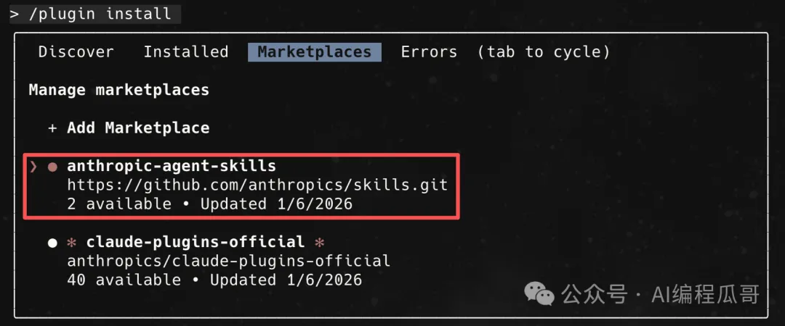

选择并安装 Skills 包

`# Skills 包说明：   1. document-skills (文档类)：包含 docx, xlsx, pptx, pdf   2. example-skills (开发/创意类)：包含 artifacts-builder, frontend-design, algorithmic-art 等   `

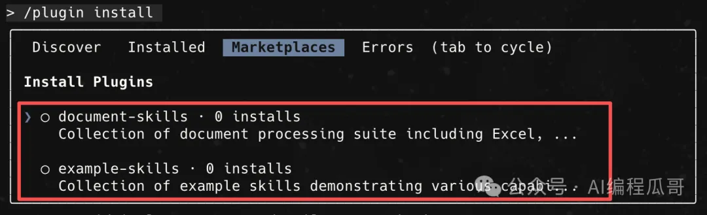

**第 3 步**，选择 Skills 包，回车安装，几秒就装上了

选择全局安装。

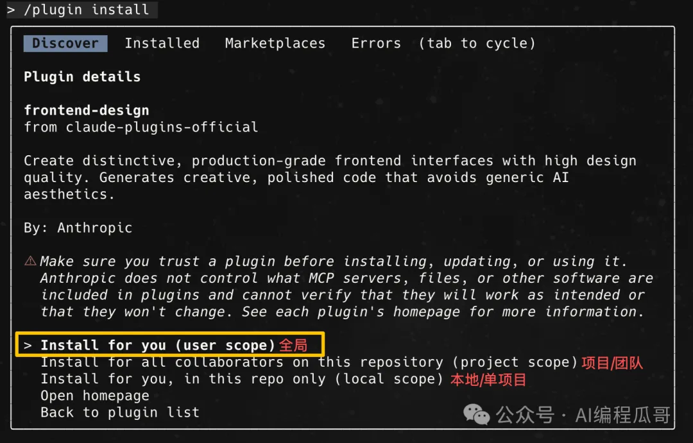

重启 Claude Code，输入 `/plugin list`，验证安装生效。

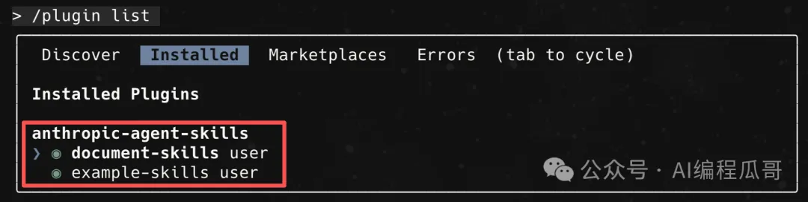

到这，官方的 Skills 包就装好了。

**tips**：

-   这些命令需要在 Claude Code 的对话界面中以 `/` 开头输入
    
-   插件安装后需要重启 Claude Code 才能生效
    

# 四、如何使用 Skill？

安装完之后，不需要手动调用。Claude 会根据你的任务自动判断要不要用。

直接在对话中提及即可：

-   "帮我提取这个 PDF 文件的表单字段"，它就会自动调用 PDF Skill
    
-   "帮我创建一个销售数据分析 Excel 表格"，它就会自动调用 xlsx Skill
    
-   "帮我生成一个算法艺术作品"，它就会调用 algorithmic-art Skill
    

  

当然，你也可以指定："用 xxx skill 帮我生成这个应用"。

## 实战 1：Frontend Design

使用 Frontend Design Skill 生成高质量前端界面。

**第 1 步**，输入以下 Prompt：

`使用 frontend-design Skill，为一个"在线笔记应用"设计一个现代化的首页界面。      要求：   1. 设计风格：极简主义 + 深色主题   2. 包含：导航栏、笔记列表、创建按钮、搜索框   3. 使用 React + Tailwind CSS   4. 避免"AI味"设计（不要紫色渐变、过度居中、Inter字体）   5. 最后生成一个可以直接在 Claude.ai 中使用的 HTML Artifact      设计思路：   - 配色：深灰色背景 + 亮色强调   - 排版：左侧导航 + 右侧内容区   - 交互：悬停效果、平滑过渡   `

**第 2 步**，任务执行

Claude 调用 `frontend-design` Skill，生成完整的 React 代码。不再是千篇一律的紫色渐变，细节设计和排版都很精细。

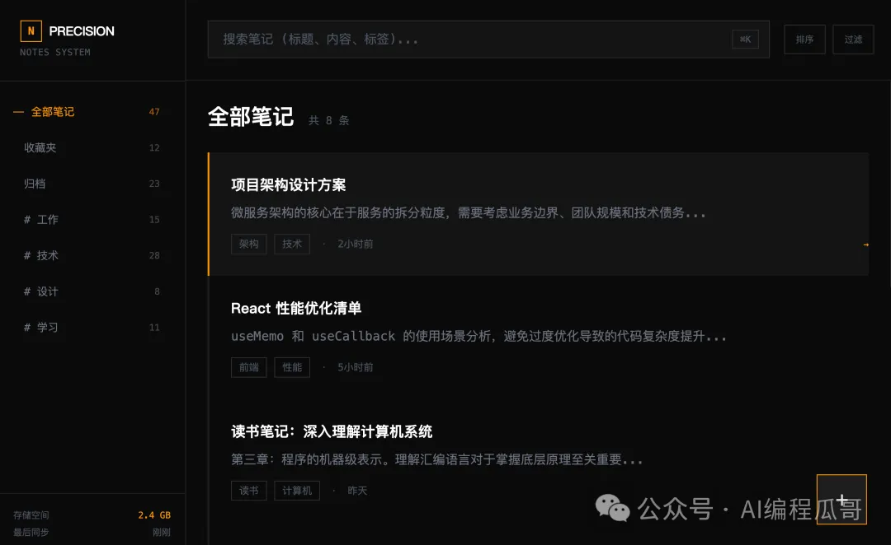

## 实战 2：Algorithmic Art

使用 Algorithmic Art Skill 生成算法艺术。

**第 1 步**，输入 Prompt：

`使用 algorithmic-art Skill，创建一个"流体艺术"作品。      步骤 1：先创建"算法哲学"   - 美学风格：流动、有机、自然   - 配色：蓝色系 + 白色   - 动画：缓慢流动，循环   - 交互：鼠标移动影响粒子      步骤 2：生成 p5.js 代码   - 使用 Perlin 噪声生成流场，粒子跟随流场运动   - 支持参数调整（速度、密度、颜色），支持种子随机（可复现）      步骤 3：生成交互式查看器   - 实时参数调整滑块，重新生成按钮，下载图片功能   `

**第 2 步**，调用 `algorithmic-art` Skill，执行任务

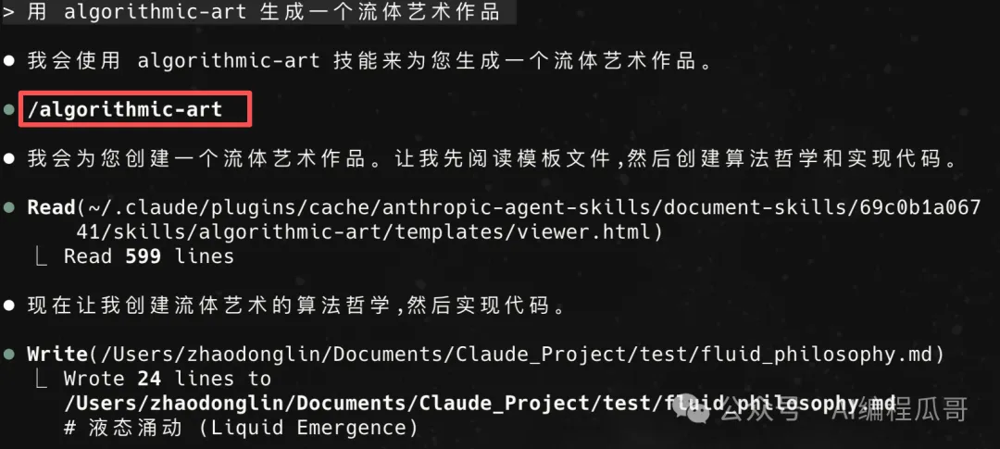

**第 3 步**，任务执行完成。生成"算法哲学"文档和 p5.js 代码

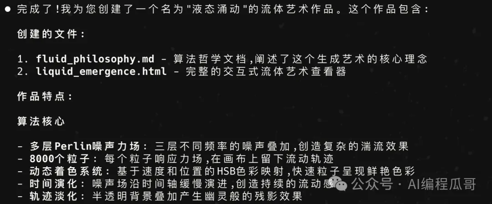

**第 4 步**，效果演示。循环动画，流动的粒子效果，还能实时参数调整（速度、密度、颜色）

# 五、创建 Skill 与常用推荐

## 01 | 手动创建 Skill 模板

这是我的结构，可照抄：

`---   name: writing-workflow   description: 技术博客写作工作流   ---   # 写作工作流   ## 核心流程   1. 理解需求   2. 信息调研   3. 选题讨论   ...   ## 风格要求   详见 [style-guide.md](./style-guide.md)   `

就两个必填字段：

-   **name**：名字
    
-   **description**：描述，Claude 靠这个判断什么时候用
    

## 02 | 我的常用 Skill 清单

官方一共提供了 14 个 Skill，我自己常用的是下面这几个，推荐给大家。

1.  **frontend-design**：用来生成高质量的前端界面
    
2.  **algorithmic-art**：用来跑算法艺术作品Demo
    
3.  **skill-creator**：用来帮助自己创建自定义 Skill
    

# 六、写在最后

Skill 这个东西，本质上就告诉大模型，把怎么干活这件事标准化了。

以前每次都要跟 Claude 解释一遍你的需求、你的格式、你的风格。现在，写一次 Skill，就不用重复了。

官方这 14 个 Skill，覆盖了文档处理、前端开发、艺术创作、内部沟通这几个最常见的场景。拿来就能用，也可以参考它们的写法，做自己的 Skill。

如你也有自己私藏的'神级 Skill'，欢迎评论区分享！

---

能看到这里的，都是对效率有极致追求的硬核玩家。不妨点个 **‘关注’** 和 **‘在看’**，给我继续码字一点支持！

## 相关资源

-   官方仓库：https://github.com/anthropics/skills
    
-   官方发布博客：https://www.anthropic.com/news/skills
    
-   官方技术博客：https://www.anthropic.com/engineering/equipping-agents-for-the-real-world-with-agent-skills
    
-   Skills 对比说明（Skills vs Prompts vs Projects vs MCP）：https://www.claude.com/blog/skills-explained
    

## 🔥 福利领取

点个 **‘关注’**，私信回复 **「工具包」**，免费获取：

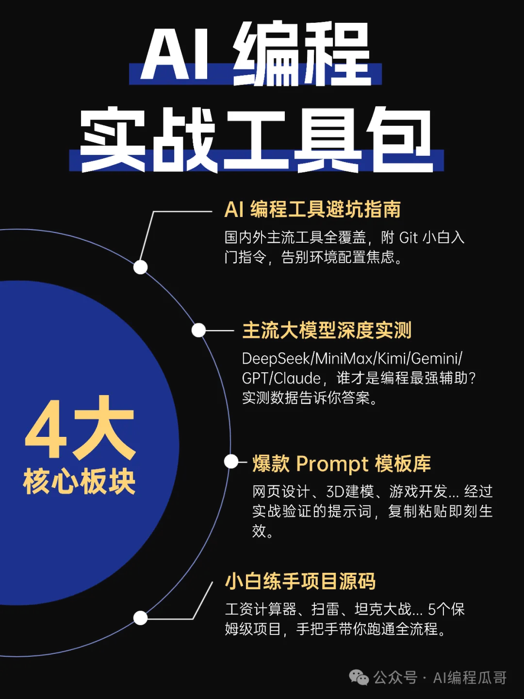

## 🚀 加入 AI 探索者社区

别再一个人摸索了。

扫码/搜索 'donglin\_zhao'，与 100+ AI 编程高手/爱好者一起，“会用 AI”变成真正的竞争力！

## 👁 阅读更多

[谷歌砸 24 亿买来的 Antigravity 强在哪？深度实测：凭什么挑战 Cursor？| 深度系列 01](https://mp.weixin.qq.com/s?__biz=Mzk5MDcyODQ2Mw==&mid=2247488347&idx=1&sn=fde3577b9cc0d02071e33f39bfdf4131&scene=21#wechat_redirect)

[3分钟建艺术站，2小时写完3D引擎，Kiro 的 Spec 模式才是未来！](https://mp.weixin.qq.com/s?__biz=Mzk5MDcyODQ2Mw==&mid=2247487903&idx=1&sn=b6c446584cbe1faa417519d0b7aff20c&scene=21#wechat_redirect)

[亚马逊杀疯了！Kiro 免绑卡、免排队、19美金直接送，这波羊毛必须薅！](https://mp.weixin.qq.com/s?__biz=Mzk5MDcyODQ2Mw==&mid=2247487678&idx=1&sn=0a26476b0e783f1d0364d4e405a8bbb9&scene=21#wechat_redirect)